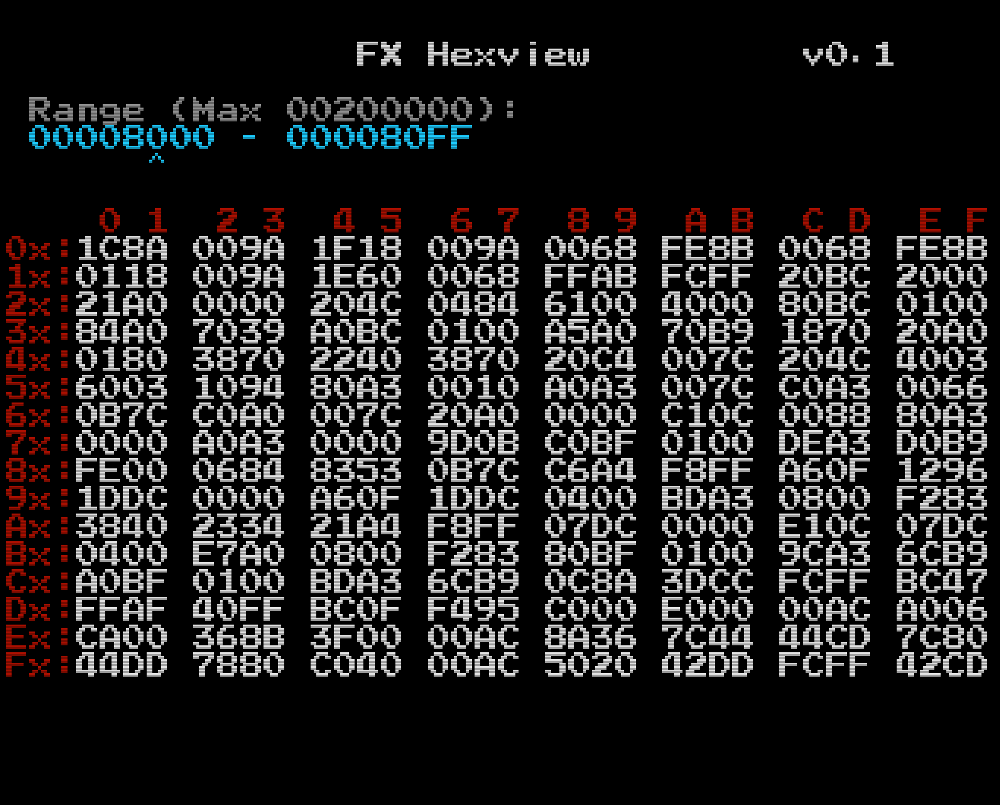

# PC-FX_Hexview

This is a  program which allows you to page through memory on the PC-FX, browsing data in hexadecimal

## Function

This was written as a utility, which may or may not have much function by itself, but
can certainly be helpful as both (a) sample code, and (b) a tester, or a test portion
of a larger process.

## How to use

### How to Run

Find the most recent date in the "src/RELEASE" folder, and use the files in there.

The most common approach would be to burn this to a disc; in this case, use the *.cue and *.bin files only.

If you have a fx_uploader, you can simply deploy the 'hexview' file through the data link.

### How to Control

This is not an editor - marely a viewer.  You can 'page' up or down through memory with the 'up' and 'down'
buttons on the controller, which move the window through memory by 256 bytes at a time.

If you hold any of the following keys, the 'page' size cange change:
- 'VI' button - instead of 256 bytes (0x100), movement becomes 4096 bytes (0x1000)
- 'V' button - instead of 256 bytes (0x100), movement becomes 65536 bytes (0x10000)
- 'IV' button - instead of 256 bytes (0x100), movement becomes 1048576 bytes (0x100000)

If you hold more than one of these buttons, the amount of movement is the highest from among the buttons pressed.

### Sample Output:

## Development Chain & Tools

This was written using a version of gcc for V810 processor, with 'pcfxtools' which assist in
building executables for PC-FX, and 'liberis' which is a library of functions targetting the PC-FX.

These can be found here:\
\
\

